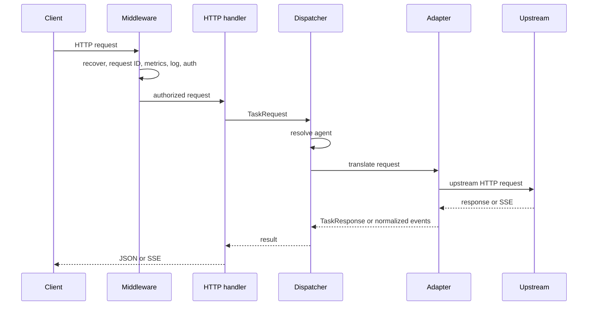

# Architecture

ProGoA2A is one Go HTTP process. Configuration is loaded at startup, five adapters are registered, and a shared dispatcher sends translated requests through a pooled `http.Client`.

## Request lifecycle

## Package map

| Path | Responsibility |
|---|---|
| `cmd/proxy` | CLI flags, config loading, adapter registration, server and worker lifecycle, signal handling |
| `pkg/config` | YAML model, `${ENV_VAR}` expansion, defaults, validation, fallback-cycle detection |
| `pkg/model` | Agent, task, artifact, event, durable job, and error types |
| `pkg/adapter` | Built-in translations and adapter registry |
| `pkg/dispatcher` | Agent selection, retry/backoff, timeout, fallback, pooled HTTP transport |
| `pkg/worker` | Durable background worker engine, distributed leasing, scheduled renewal, panic recovery, graceful drain |
| `pkg/server` | Routes, handlers, middleware, task storage integration, health/readiness |
| `pkg/storage` | TaskStore and JobRepository interfaces, in-memory cache, PostgreSQL durable backend, shared pool bundle, and migrations |
| `pkg/stream` | Thread-safe SSE writer |
| `pkg/metrics` | In-process Prometheus text collector |
| `tests` | End-to-end and benchmark suites with local mock agents |

## Middleware order

Requests pass through:

1. panic recovery;
2. request-ID creation or propagation;
3. request metrics;
4. structured request logging;
5. API-key authentication;
6. the matched handler.

The response includes `X-Request-ID`. Logs use the field `trace_id` and include method, path, status, and integer duration in milliseconds.

## Server and worker lifecycle

The HTTP server uses configured read, write, and idle timeouts. SSE handlers clear the per-response write deadline so a long stream is not cut off by `write_timeout_seconds`.

The background worker engine (`pkg/worker`) operates on at-least-once delivery semantics:
1. Claims ready jobs with database time using `AcquireLeases`, bounded by available concurrency capacity.
2. Transitions claimed jobs to `running` with fencing tokens before execution.
3. Extends leases periodically on schedule via `RenewLease`, checking for cancellation requests.
4. Executes jobs through `JobExecutor`, decoding payloads, enforcing routing, intercepting panics, and making exactly one downstream attempt per lease. Durable retries and backoff are controlled only by the job ledger.
5. Persists sanitized terminal outcomes (`CompleteJob`, `FailJob`, or `AcknowledgeCancellation`).
6. Reclaims expired leases periodically via `ReclaimExpiredLeases`.

On `SIGINT` or `SIGTERM`, graceful shutdown initiates:
- `api` role requests graceful HTTP server shutdown with a 15-second deadline.
- `worker` role stops acquiring new leases, allows active jobs to drain while leases continue renewing, and cancels execution contexts only after reaching `drain_timeout_seconds`.
- `all` role runs both server and worker concurrently, sharing a single PostgreSQL pool bundle (`PostgresBundle`), and shuts both down gracefully on signal.

## State and scaling

Routing and adapter configurations are read-only after startup.

Task responses from synchronous invocations are stored in `TaskStore` (`memory` FIFO ring cache or `postgres` table `task_results`). Durable background jobs are managed through `JobRepository` (`postgres` table `durable_jobs`) with monotonically increasing lease fencing tokens.

When running horizontally with multiple replicas:
- `api` replicas handle stateless HTTP invocation and durable task retrieval.
- `worker` replicas concurrently process durable background jobs using database-level skip-locked lease acquisition and optimistic fencing.
- In `all` role, each instance runs both API endpoints and background workers over a unified, shared connection pool.

See the [PostgreSQL storage guide](../deployment/postgresql.md) for full deployment and operational details.
