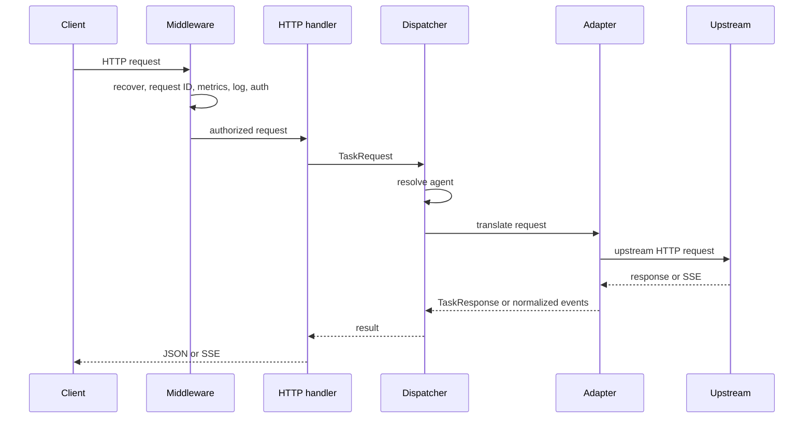

# Architecture

ProGoA2A is one Go HTTP process. Configuration is loaded at startup, five adapters are registered, and a shared dispatcher sends translated requests through a pooled `http.Client`.

## Request lifecycle

## Package map

| Path | Responsibility |
|---|---|
| `cmd/proxy` | CLI flags, config loading, adapter registration, server lifecycle, signal handling |
| `pkg/config` | YAML model, `${ENV_VAR}` expansion, defaults, validation, fallback-cycle detection |
| `pkg/model` | Agent, task, artifact, event, and error types |
| `pkg/adapter` | Built-in translations and adapter registry |
| `pkg/dispatcher` | Agent selection, retry/backoff, timeout, fallback, pooled HTTP transport |
| `pkg/server` | Routes, handlers, middleware, in-memory task cache, health/readiness |
| `pkg/stream` | Thread-safe SSE writer |
| `pkg/metrics` | In-process Prometheus text collector |
| `tests` | End-to-end and benchmark suites with local mock agents |

## Middleware order

Requests pass through:

1. panic recovery;
2. request-ID creation or propagation;
3. request metrics;
4. structured request logging;
5. API-key authentication;
6. the matched handler.

The response includes `X-Request-ID`. Logs use the field `trace_id` and include method, path, status, and integer duration in milliseconds.

## Server lifecycle

The server uses configured read, write, and idle timeouts. SSE handlers clear the per-response write deadline so a long stream is not cut off by `write_timeout_seconds`. On `SIGINT` or `SIGTERM`, the process requests graceful shutdown with a fixed 15-second deadline.

## State and scaling

Routing/configuration is read-only after startup. The only request-derived application state is the bounded synchronous task-result cache and in-process metrics. Both are local to one replica and reset on restart. Horizontal replicas therefore work for stateless invocation, but task retrieval and metric aggregation require operational care.
