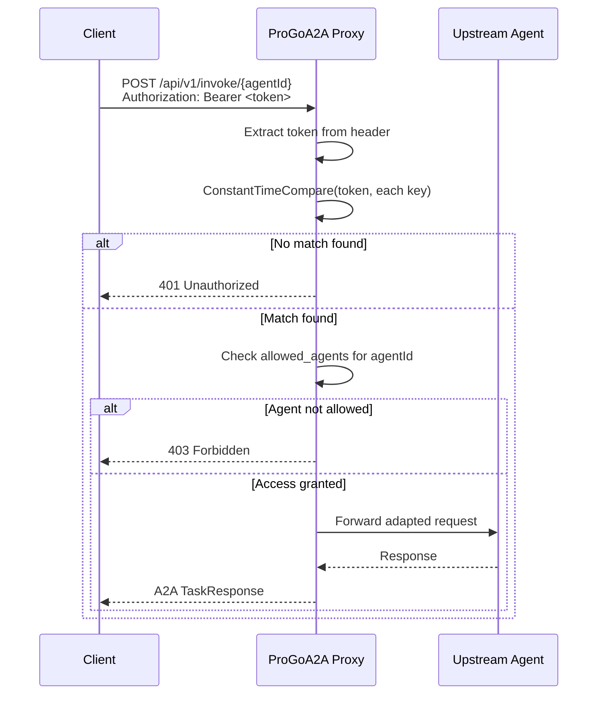
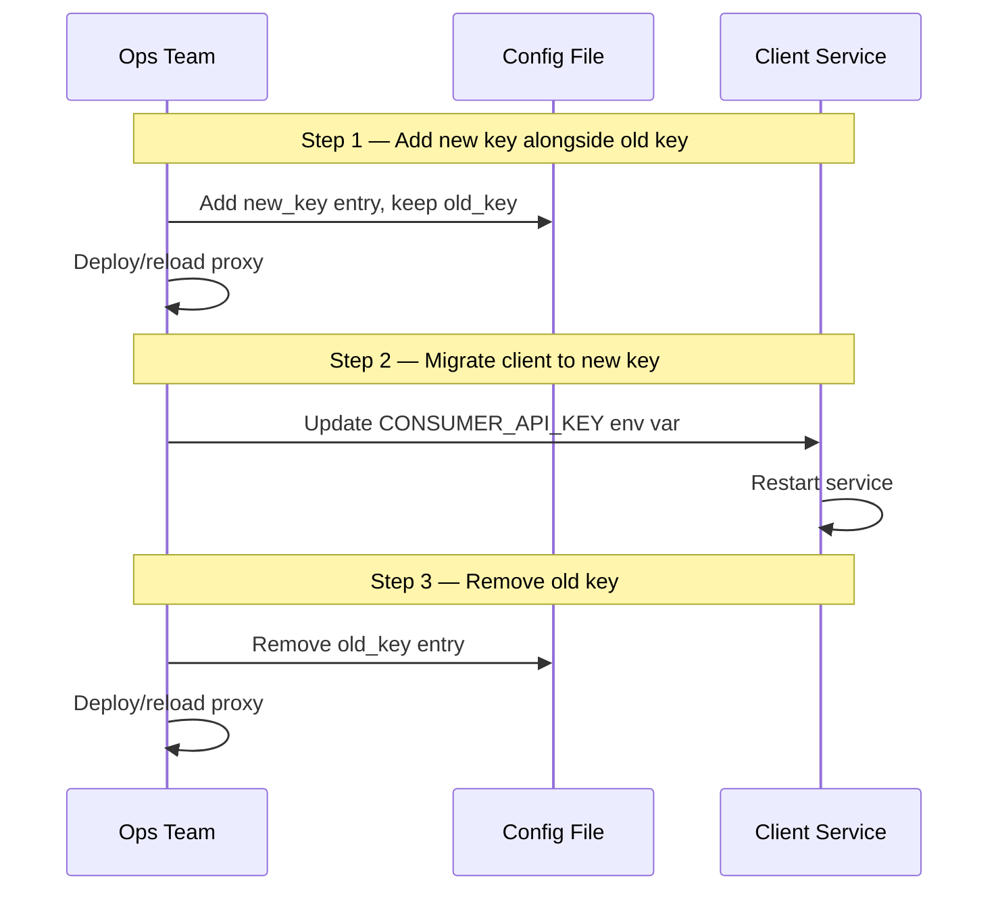

# Security & RBAC

ProGoA2A ships with lightweight API-key authentication, per-agent authorization, and a request-size limit. Treat this as one layer of a production security design, not a complete identity or edge-security system.

---

## Authentication Model

When `security.enabled: true`, protected requests must present either a bearer token or `X-API-Key`:

```
Authorization: Bearer <your-api-key>
# or
X-API-Key: <your-api-key>
```

Requests without this header, or with an unrecognized token, are rejected with HTTP `401 Unauthorized` before any upstream call is made.

### Flow Diagram



---

## Constant-Time Comparison

Token validation uses Go's `crypto/subtle.ConstantTimeCompare` instead of a simple string equality check:

```go
// Timing-safe comparison — both branches execute in equal time
if subtle.ConstantTimeCompare([]byte(provided), []byte(stored)) == 1 {
    // authenticated
}
```

This reduces comparison timing leakage for each candidate key. Overall request time can still vary with key count and match position because the implementation stops after the first match; edge rate limiting remains important.

---

## Role-Based Access Control (RBAC)

Authorization in ProGoA2A is per-key, per-agent. Each API key definition carries an `allowed_agents` list that controls which agent IDs that key may call.

### Wildcard Access

```yaml
api_keys:
  - key: "${ADMIN_API_KEY}"
    client_id: "admin-service"
    allowed_agents:
      - "*"   # This key can call ANY agent
```

### Restricted Access

```yaml
api_keys:
  - key: "${ANALYTICS_API_KEY}"
    client_id: "analytics-service"
    allowed_agents:
      - "openai-gpt4o"
      - "langgraph-researcher"
      # Cannot call "custom-enterprise-agent" or any other agent
```

### How Access Is Checked Per Request

For each protected request:

1. The token is extracted from the `Authorization` header.
2. The token list is scanned using constant-time comparison until a match is found (or the list is exhausted).
3. If an agent can be identified from the route, query, or task body, the matched key's `allowed_agents` list is checked:
   - If `"*"` is present → access granted.
   - If the request's `{agentId}` appears in the list → access granted.
   - Otherwise → `403 Forbidden`.

!!! note "Client identity"
    The matched `client_id` is attached to the request context for handlers. The current structured request logger does not emit it, so add that field before relying on logs as a per-client audit trail.

---

## Best Practices

### 1. Never hardcode secrets

Always use `${ENV_VAR}` references in your config file:

=== "Good ✅"
    ```yaml
    api_keys:
      - key: "${ADMIN_API_KEY}"
        client_id: "admin"
        allowed_agents: ["*"]
    ```

=== "Bad ❌"
    ```yaml
    api_keys:
      - key: "super-secret-hardcoded-token-123"
        client_id: "admin"
        allowed_agents: ["*"]
    ```

Hardcoded secrets end up in version control history. Use your platform's secret management (Kubernetes Secrets, HashiCorp Vault, AWS Secrets Manager, GCP Secret Manager, etc.).

### 2. Use a unique key per client/service

Assign one API key per downstream consumer, not one shared key for everyone. This enables:

    - **Future audit trails**: the context retains client identity, which a custom logger can emit.
- **Blast-radius containment**: revoking one key doesn't break other services.
- **Fine-grained RBAC**: different services get access to different agents.

```yaml
api_keys:
  - key: "${FRONTEND_API_KEY}"
    client_id: "web-frontend"
    allowed_agents: ["openai-gpt4o"]

  - key: "${DATA_PIPELINE_KEY}"
    client_id: "data-pipeline"
    allowed_agents: ["langgraph-researcher"]

  - key: "${INTERNAL_ADMIN_KEY}"
    client_id: "internal-admin"
    allowed_agents: ["*"]
```

### 3. Zero-downtime key rotation

ProGoA2A supports multiple keys simultaneously, enabling rolling rotations **without downtime**:



During step 1 and step 2, both keys are valid. No requests are dropped.

---

## DoS Protection

### 10 MB Body Limit

Task and direct-invocation request bodies are limited to **10 MiB**. Requests exceeding this limit are rejected with `413 Request Entity Too Large`. Discovery and operational GET routes do not consume request bodies.

This limit is applied globally and is not currently configurable per-agent.

---

## TLS / HTTPS

!!! warning "ProGoA2A does not terminate TLS"
    The proxy listens on plain HTTP. **Do not expose it directly to the internet.** Always deploy it behind a TLS-terminating reverse proxy.

Deploy ProGoA2A behind **Nginx**, **Traefik**, **Caddy**, or a cloud load balancer that handles HTTPS:

=== "Nginx"
    ```nginx
    server {
        listen 443 ssl;
        server_name proxy.example.com;

        ssl_certificate     /etc/ssl/certs/proxy.crt;
        ssl_certificate_key /etc/ssl/private/proxy.key;

        location / {
            proxy_pass http://127.0.0.1:8080;
            proxy_set_header Host $host;
            proxy_set_header X-Real-IP $remote_addr;
            proxy_read_timeout 130s;   # Slightly above write_timeout_seconds
        }
    }
    ```

=== "Traefik"
    ```yaml
    # docker-compose.yml snippet
    services:
      traefik:
        image: traefik:v3
        command:
          - "--providers.docker=true"
          - "--entrypoints.websecure.address=:443"
          - "--certificatesresolvers.le.acme.tlschallenge=true"

      progo-a2a:
        image: progo-a2a:latest
        labels:
          - "traefik.enable=true"
          - "traefik.http.routers.progo.rule=Host(`proxy.example.com`)"
          - "traefik.http.routers.progo.entrypoints=websecure"
          - "traefik.http.routers.progo.tls.certresolver=le"
          - "traefik.http.services.progo.loadbalancer.server.port=8080"
    ```

=== "Caddy"
    ```caddyfile
    proxy.example.com {
        reverse_proxy localhost:8080
    }
    ```

---

## Production Security Checklist

!!! warning "Complete this checklist before going to production"

    - [ ] `security.enabled: true` is set in config
    - [ ] All `key` values use `${ENV_VAR}` references — no hardcoded secrets
    - [ ] Each downstream service has its **own unique API key**
    - [ ] `allowed_agents` is **restricted** for each key (no unnecessary wildcard `"*"` access)
    - [ ] The proxy is behind a **TLS-terminating reverse proxy** (Nginx, Traefik, Caddy, etc.)
    - [ ] `write_timeout_seconds` exceeds the longest `agent.timeout_seconds` value
    - [ ] Secrets are managed via a **secrets manager** (Vault, AWS Secrets Manager, K8s Secrets, etc.)
    - [ ] API keys are **rotated** on a regular schedule or after any suspected compromise
    - [ ] Access logs are shipped to a **SIEM or log aggregation system** for audit trails
    - [ ] The proxy is **not exposed** directly on a public IP without TLS
    - [ ] Outbound agent endpoints use `https://` where available
