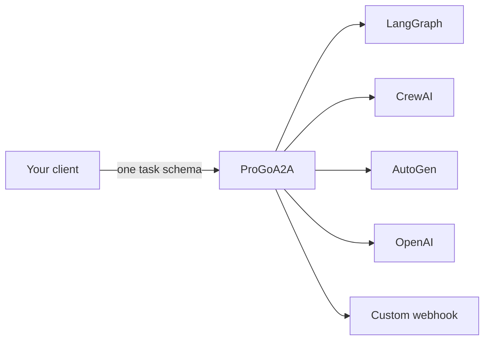

# Getting started

ProGoA2A is a small Go gateway that gives clients one task schema while translating requests to several agent-framework HTTP APIs. This section gets the gateway running and makes a real request.

## What you need

- Go 1.26.6 or newer, or Docker, depending on how you run the service.
- Git to clone the repository.
- An accessible downstream HTTP API.
- Credentials for that downstream, if it requires authentication.

The current automated checks run on Linux, and development has also been verified on macOS/arm64.

## Choose a path

-   **Install**

    [Build from source or build the local Docker image.](installation.md)

-   **Run a request**

    [Create a minimal configuration and invoke an agent.](quickstart.md)

-   **Understand the config**

    [Review every supported YAML field.](../configuration/index.md)

## What the gateway does

The proxy owns routing, upstream request translation, retry/fallback policy, inbound API-key checks, stream normalization, and basic operational telemetry. It does not run agents itself, persist tasks durably, terminate TLS, or provide full conformance with the official A2A JSON-RPC protocol.

## Next

[Install ProGoA2A](installation.md){ .md-button .md-button--primary }
