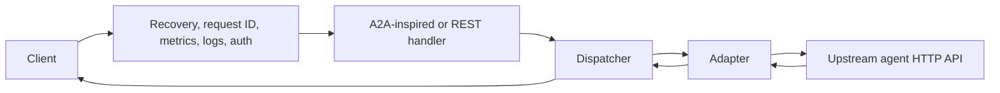

# ProGoA2A

<div class="hero" markdown>

**A fast, configurable gateway for invoking heterogeneous AI-agent HTTP APIs through one interface.**

[Get started](getting-started/index.md){ .md-button .md-button--primary }
[View on GitHub](https://github.com/Coder-in-a-shell/progo-a2a){ .md-button }

</div>

ProGoA2A translates one task schema into the request formats used by LangGraph, CrewAI, AutoGen, OpenAI Chat Completions, or a custom HTTP endpoint. It also provides routing, retries, fallback agents, API-key authorization, SSE streaming, health checks, JSON logs, and Prometheus-format metrics.

!!! note "Protocol scope"
    `/a2a/v1` is ProGoA2A's A2A-inspired HTTP surface. The current implementation is not a full implementation of the official A2A protocol or its JSON-RPC wire format. See [A2A protocol scope](concepts/a2a-protocol.md).

## Highlights

<div class="grid cards" markdown>

-   :material-swap-horizontal: **Five adapters**

    LangGraph, CrewAI, AutoGen, OpenAI Chat Completions, and configurable custom webhooks.

-   :material-routes: **Routing and resilience**

    Direct or capability-based selection, attempt-scoped timeouts, jittered retries, and ordered fallbacks.

-   :material-broadcast: **Streaming**

    Normalizes supported upstream SSE streams into `task_started`, `step_progress`, `token_delta`, `task_completed`, and `task_error` events.

-   :material-shield-key: **Gateway security**

    API-key authentication with per-agent allowlists and constant-time secret comparison.

-   :material-chart-line: **Operations**

    Health/readiness endpoints, structured request logs, request IDs, and Prometheus text exposition.

-   :material-language-go: **Small Go service**

    A single binary built on `net/http`, with a pooled upstream HTTP transport.

</div>

## Quick start

```bash
git clone https://github.com/Coder-in-a-shell/progo-a2a.git
cd progo-a2a
make build
cp config/progo-a2a.example.yaml progo-a2a.yaml
./bin/progo-a2a -config progo-a2a.yaml
```

In another terminal:

```bash
curl http://localhost:8080/healthz
```

```json
{"status":"healthy","time":"2026-09-10T00:00:00Z"}
```

The checked-in example contains placeholder endpoints and credentials. Edit it before invoking an agent. The [Quickstart](getting-started/quickstart.md) walks through a minimal OpenAI-backed configuration.

## Request path



## Measured performance

The repository includes microbenchmarks in `tests/benchmark_test.go`. On an Apple M2 with Go 1.26.5, a short local run measured approximately 42–47 µs/op for direct dispatch and 57 µs/op through the A2A task HTTP route. These numbers measure local proxy/test-server overhead, not real upstream latency. Run the suite on your target hardware:

```bash
make bench
```

Do not treat microbenchmark request rates as a production capacity guarantee; network latency, payload size, logging, authentication, and upstream behavior dominate real deployments.

## Documentation map

<div class="grid cards" markdown>

-   :material-rocket-launch: [**Getting started**](getting-started/index.md)

    Install, configure, and make the first request.

-   :material-cog: [**Configuration**](configuration/index.md)

    Every supported YAML field, secret interpolation, and RBAC behavior.

-   :material-connection: [**Adapters**](adapters/index.md)

    Exact request and response translations for every built-in adapter.

-   :material-api: [**API reference**](api/index.md)

    Routes, schemas, errors, streaming events, health, metrics, and logs.

-   :material-server: [**Deployment**](deployment/docker.md)

    Container and Kubernetes examples plus a production checklist.

</div>
